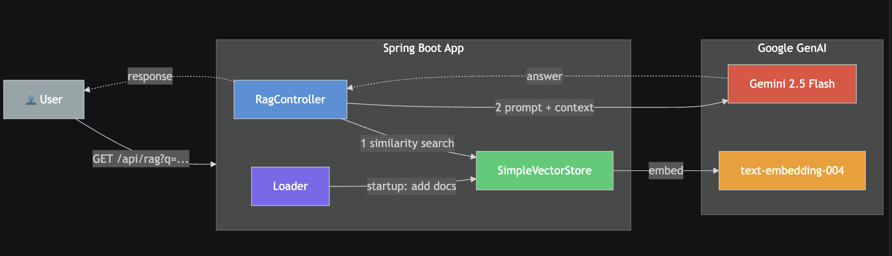

# Spring AI RAG with Vector Search and Gemini 2.5

## Run
1. Set your Google API key in `application.yaml`
2. mvn clean install
3. mvn spring-boot:run

## Test
GET http://localhost:8080/api/rag?q=funny
Body: plain text prompt

# Configuring API Key Access
https://aistudio.google.com/api-keys

# Flow Diagram

# High-Level Overview

